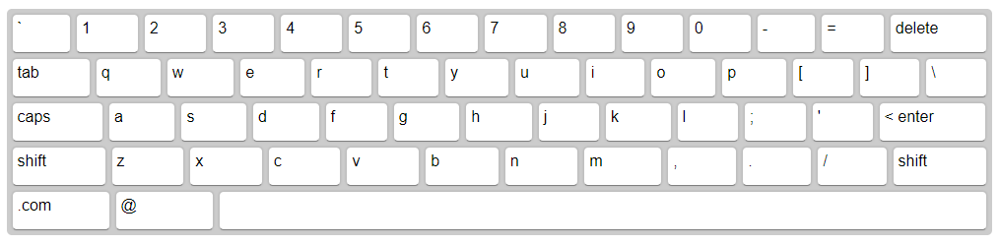
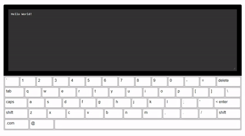

# simple-keyboard

[](https://www.npmjs.com/package/simple-keyboard)
[](https://www.npmjs.com/package/simple-keyboard)
[](https://www.npmjs.com/package/simple-keyboard)
[](https://www.npmjs.com/package/simple-keyboard)

[](https://npmjs.com/package/simple-keyboard)

> An easily customisable and responsive on-screen virtual keyboard for React.js projects.



## Installation

`npm install simple-keyboard --save`

## Usage

````js
import React, {Component} from 'react';
import Keyboard from 'simple-keyboard';
import 'simple-keyboard/build/css/index.css';

class App extends Component {

  onChange = (input) => {
    console.log("Input changed", input);
  }

  onKeyPress = (button) => {
    console.log("Button pressed", button);
  }

  render(){
    return (
      <Keyboard
        onChange={input =>
          this.onChange(input)}
        onKeyPress={button =>
          this.onKeyPress(button)}
      />
    );
  }
}

export default App;
````

> Need a more extensive example? [Click here](https://github.com/hodgef/simple-keyboard/blob/master/src/demo/App.js).

## Options

You can customize the Keyboard by passing options (props) to it.
Here are the available options (the code examples are the defaults):

### layout

> Modify the keyboard layout

```js
layout={{
  'default': [
    '` 1 2 3 4 5 6 7 8 9 0 - = {bksp}',
    '{tab} q w e r t y u i o p [ ] \\',
    '{lock} a s d f g h j k l ; \' {enter}',
    '{shift} z x c v b n m , . / {shift}',
    '.com @ {space}'
  ],
  'shift': [
    '~ ! @ # $ % ^ & * ( ) _ + {bksp}',
    '{tab} Q W E R T Y U I O P { } |',
    '{lock} A S D F G H J K L : " {enter}',
    '{shift} Z X C V B N M < > ? {shift}',
    '.com @ {space}'
  ]
}}
```

### layoutName

> Specifies which layout should be used.

```js
layoutName={"default"}
```

### display

> Replaces variable buttons (such as `{bksp}`) with a human-friendly name (e.g.: "delete").

```js
display={{
  '{bksp}': 'delete',
  '{enter}': '< enter',
  '{shift}': 'shift',
  '{s}': 'shift',
  '{tab}': 'tab',
  '{lock}': 'caps',
  '{accept}': 'Submit',
  '{space}': ' ',
  '{//}': ' '
}}
```

### theme

> A prop to add your own css classes. You can add multiple classes separated by a space.

```js
theme={"hg-theme-default"}
```

### debug

> Runs a console.log every time a key is pressed. Displays the buttons pressed and the current input.

```js
debug={false}
```

## Demo



To run demo on your own computer:

* Clone this repository
* `npm install`
* `npm start`
* Visit [http://localhost:3000/](http://localhost:3000/)

## Note

This is a work in progress. Feel free to submit any issues you have at:
[https://github.com/hodgef/simple-keyboard/issues](https://github.com/hodgef/simple-keyboard/issues)
